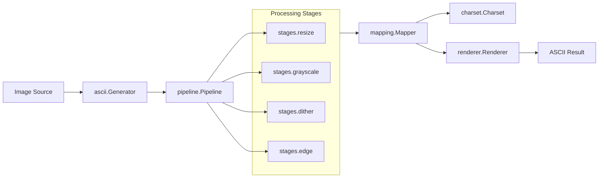

# Design - Ascii Generator

## Problem Statement
We are trying to solve the challenge of converting images into ASCII art while maintaining a balance between performance and visuals.

## Requirements
### Functional
- The system must convert various image formats to ASCII art.
- Users should be able to configure the processing pipeline.
- The application should support multiple character sets for ASCII representation.

### Non-Functional
- Performance: The conversion should be efficient and fast.
- Memory: The application should use minimal memory resources.
- Simplicity: The user interface and configuration should be straightforward and easy to use.

## Architecture Overview

## 🔄 Alternatives Considered
| Option | Pros | Cons | Why Rejected |
|------|------|------|-------------|
| Using a third-party library | Faster implementation | Dependency management | Breaking project constraints + limited control over performance |
| Custom algorithm development | Full control | Longer development time | Requires extensive testing |

## Trade-offs
Sacrificing precision for speed. Most of the algorithms would have some "shortcuts" that allow them to gain speed without significantly compromising the quality of the ASCII output.

## 🔬 Open Questions
- What image formats should be prioritized for support?
- How can we optimize the character mapping for different image types?

## Success Criteria
What does “done” look like?
- Successful conversion of images to ASCII art with configurable options.
- Performance benchmarks meet predefined criteria.
