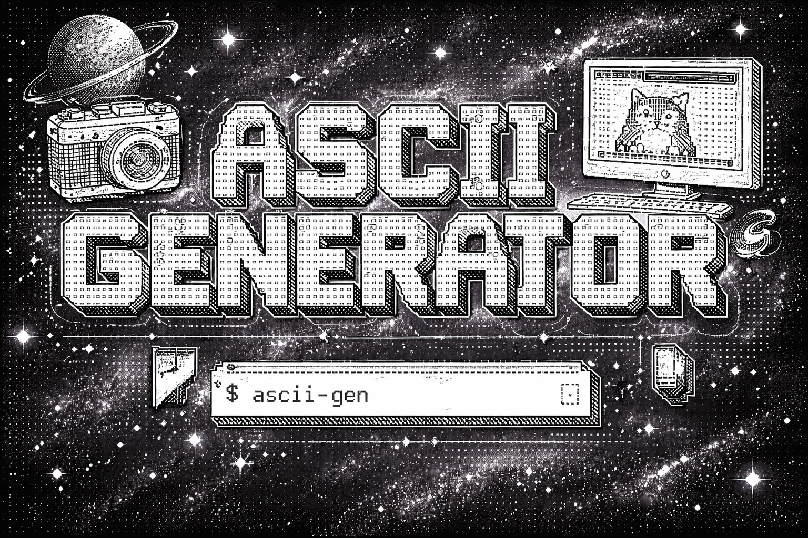

# P02 — Ascii Generator

> 26 in 26 · Weeks 03–04 · image processing
<p align="center"></p>

## Goal
Build a high-performance package that encapsulates image processing techniques to generate ASCII art from images with configurable pipelines and algorithms.

## Scope
**In scope**
- Core image-to-ASCII conversion engine
- Configurable processing pipeline (sampling, resizing, dithering, mapping)
- Multiple character set options (density levels, custom sets)
- Performance optimization for real-time processing
- Support for common image formats

**Out of scope**
- GUI/frontend implementation
- Video streaming processing
- Advanced color-to-grayscale algorithms beyond standard methods

## Timeline
- **Week 1:** Design, research, POC
- **Week 2:** Implementation, testing, docs

## Status
- [X] Design
- [X] POC
- [X] Core implementation
- [ ] Tests
- [ ] Documentation

## 🛠 Tech Stack
- Language: Go
- Constraints: no external image processing packages

## 🚀 Running the Project
```bash
# example
make run
```

## 📋 API Overview
- Image loading and preprocessing
- Configurable algorithm pipeline
- Character mapping strategies
- Output formatting options

## Postmortem

### The Refactoring Trap

The core functionality worked well during the first week—the image processing pipeline executed correctly, and the ASCII conversion produced solid results. However, I spent disproportionate time refactoring the library interface and internal architecture, cycling through multiple structural approaches without clear justification.

**Architectures Attempted:**
- **Pipeline/DAG model:** Attempted to model stages as a directed acyclic graph where each processing step feeds into the next
- **Pub-sub architecture:** Experimented with an event-driven approach where stages published outputs and subscribers consumed them
- **Functional builder pattern:** Tried various option and builder patterns for configurable stage creation

Each iteration seemed promising in isolation, but the real issue was at the **library user interface layer**—the abstraction exposed to consumers of the pipeline. Every redesign either:
- Gave too much control (forcing users to manually wire complex DAG structures)
- Gave too little control (hiding configuration behind opaque defaults)

This became a case of endless nitpicking rather than solving a real problem. The original design functioned well; I was optimizing for perceived elegance rather than actual user needs or performance constraints.

### Key Learnings

1. **Working code beats perfect code:** A functioning system with a "good enough" interface creates value immediately. Refactoring in search of theoretical perfection without concrete user feedback is a black hole.

2. **Validate the abstraction with real users early:** I should have written sample CLI commands or test harnesses using the library API before committing to a final structure. This would have surfaced the control imbalance problem sooner.

3. **Technical debt is only debt when it causes problems:** The original structure wasn't unmaintainable or confusing in practice. Refactoring it wasn't fixing a bug—it was creating churn.

4. **Time allocation matters:** Spending ~30% of the project on architecture refinement when the feature works teaches a hard lesson about shipping. The time would have been better spent on optimization, testing, or documentation.

### Takeaway

**Done and shipped beats perfect and iterating indefinitely.** Next time, I'll set a clear stopping point: once the interface is functional and users can accomplish their goals, design complexity should be measured against actual pain points, not architectural aesthetics.
